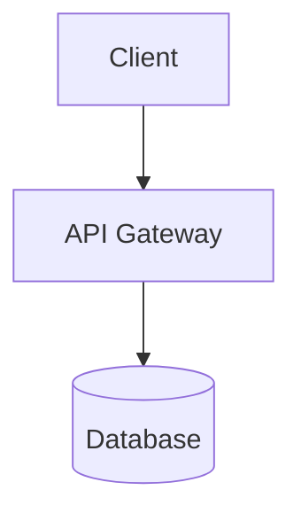

# Technical Case Studies — Adding New Projects

This document explains how to add, manage, and configure project case studies for the `/case-studies` section of this portfolio.

---

## Quick Start: Adding a New Project

1. Create a new `.md` file in `src/content/case-studies/`
2. Name it using a URL-friendly slug (e.g. `my-new-project.md`)
3. Add the required frontmatter block at the top
4. Write your case study content in Markdown
5. Run `npm run dev` — the project will appear automatically on `/case-studies`

---

## Frontmatter Schema

Every project file **must** start with a YAML frontmatter block:

```yaml
---
title: "Your Project Title"
slug: "url-friendly-slug"                   # Must match the filename (without .md)
description: "One or two sentence summary"  # Shown on cards and in meta tags
tags: ["FHIR", "Go", "PostgreSQL"]          # Used for filtering (see tag list below)
category: "System Integration"              # See categories below
stack: ["Go", "PostgreSQL", "Docker"]       # Technology stack items
featured: false                             # true = pinned to top of index
date: "2025-01-15"                          # ISO date of publication (YYYY-MM-DD)
duration: "3 months"                        # Human-readable project duration
role: "Backend Engineer"                    # Your role on the project
readTime: 10                                # Estimated read time in minutes (optional)
---
```

### Available Categories

| Value | Description |
|---|---|
| `System Integration` | Middleware, gateways, interoperability layers |
| `API Development` | REST/GraphQL/FHIR API servers |
| `Backend Infrastructure` | Core platform, database, messaging architecture |
| `Data Engineering` | Pipelines, ETL, data transformation |

### Common Tags

Healthcare domain: `FHIR`, `HL7`, `DICOM`, `PACS`, `SMART on FHIR`, `HIPAA`, `Middleware`, `Integration`

Languages & frameworks: `Go`, `Python`, `TypeScript`, `PostgreSQL`, `Redis`, `RabbitMQ`

Infrastructure: `Kubernetes`, `Docker`, `Nginx`, `Keycloak`, `Prometheus`, `OpenTelemetry`

---

## Case Study Structure

Each case study should include these sections (in order):

```markdown
## Overview
2–3 paragraphs: project context, business problem, scope, key stakeholders.

## Problem Statement
Technical challenges, legacy constraints, compliance requirements.
Use H3 sub-headings for each challenge.

## Solution Architecture
High-level design rationale. Include a Mermaid architecture diagram.

## Technical Implementation
Core services, database design, data flow. Include a Mermaid sequence diagram.
Add anonymized code snippets for key patterns.

## Technology Stack
A markdown table listing each layer, technology used, and rationale.

## Technical Challenges & Solutions
At least 3 specific problems encountered and how they were solved.
Include anonymized code examples.

## API Design Examples
HTTP request/response examples using dummy data. Never use real patient data.

## Results & Metrics
Quantified outcomes: latency improvements, uptime, adoption, developer experience.
```

---

## Mermaid Diagrams

Mermaid fenced code blocks render automatically in MDSveX:

````markdown

````

**Tips:**
- Use `graph TB` for top-to-bottom architecture diagrams
- Use `sequenceDiagram` for request/response flow
- Use `erDiagram` for database schema (optional)
- Quote node labels containing parentheses: `A["Label (extra)"]`
- Wrap long labels in `subgraph` blocks for clarity

---

## Code Snippets

All code examples must use **dummy data only**:

- ✅ Use placeholder UUIDs, names, and URLs
- ✅ Use anonymized system names (e.g., `"facility-central"`, not real system names)
- ✅ Show patterns, not production secrets
- ✅ Include error handling examples
- ⛔ No real patient MRNs, names, or dates of birth
- ⛔ No real API keys, tokens, or connection strings
- ⛔ No real company names or internal system identifiers

Use language identifiers in fenced code blocks for syntax highlighting:

````markdown
```go
func example() string {
    return "highlighted by Shiki"
}
```
````

Supported languages include: `go`, `typescript`, `sql`, `yaml`, `json`, `bash`, `http`.

---

## File Naming

The file name **must match** the `slug` field in frontmatter:

| Filename | slug field |
|---|---|
| `fhir-api-server.md` | `fhir-api-server` |
| `dicom-imaging-gateway.md` | `dicom-imaging-gateway` |

The slug is used as the URL: `/case-studies/fhir-api-server`.

---

## Content Privacy Checklist

Before publishing, ensure:

- [ ] No real patient names, IDs, dates of birth, or clinical data
- [ ] All system names are anonymized (use generic labels like "EMR System A")
- [ ] All UUIDs and identifiers are dummy values
- [ ] No internal company names in code comments
- [ ] No API keys, tokens, passwords, or connection strings
- [ ] No real IP addresses or internal hostnames
