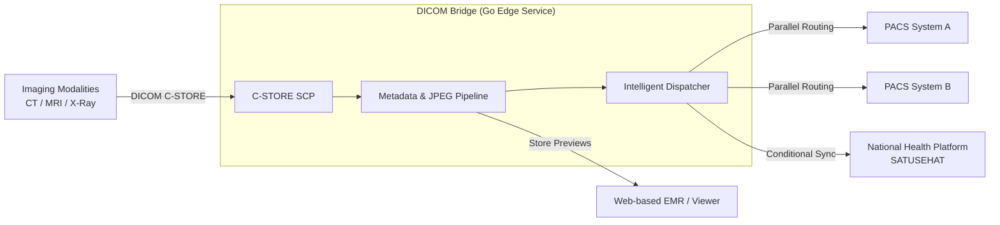

## Technical Impact

*   **National Interoperability**: Engineered the conditional routing logic required to sync clinical imaging metadata with the **SATUSEHAT Kemenkes** platform.
*   **Operational Speed**: Automated the generation of **JPEG previews** from heavy DICOM files, enabling clinicians to view images instantly via web dashboards without waiting for full DICOM retrieval.
*   **Smart Routing (Fan-out)**: Implemented a multi-destination engine that allows a single imaging study to be delivered to separate PACS systems and cloud storage simultaneously.
*   **Legacy-to-Modern Bridge**: Successfully bridged legacy imaging equipment (some running older DICOM dialects) with modern REST/FHIR-based cloud architectures.
*   **From Research to Production**: Successfully evolved the project from a containerized research tool (**`docker-dcmkit`**) into a battle-tested production service.

---

## Edge Gateway Architecture

The system sits at the "Edge" of the hospital network, acting as a traffic controller for binary medical data.

### Key Engineering Features

1.  **High-Performance Ingestion**: Built on a Go service layer that wraps **DCMTK** and **GDCM** for robust handling of the DICOM network protocol.
2.  **Image Transformation Pipeline**: Automatically extracts pixel data and applies window-leveling to generate web-ready JPEGs, significantly reducing front-end latency for non-diagnostic viewing.
3.  **Conditional Dispatcher**: A rule-based engine that determines where data should go based on the imaging study's metadata (Modality type, Patient ID, or Referring Physician).

---

## The Challenge: Clinical Silos
In most hospitals, if you buy a new PACS system, you have to reconfigure every single scanner (Modality) to "talk" to it. This is a massive operational bottleneck.
Furthermore, integrating with the national health platform (**SATUSEHAT**) adds a layer of complexity that legacy scanners simply cannot handle natively.

---

## The Engineering Solution

### 1. The "Man-in-the-Middle" Strategy
By placing the DICOM Bridge between the scanners and the PACS, I created a **single point of configuration**. Scanners send data to the Bridge, and the Bridge handles the rest.
**Result**: Adding a new PACS or cloud backup now takes minutes of configuration instead of days of physical modality tinkering.

### 2. Research-to-Production Pipeline
This project started as **`docker-dcmkit`**, a personal research project to containerize DICOM tools. Recognizing its potential, I expanded it into a full service with:
*   Standardized logging.
*   Error-handling for unreliable hospital networks.
*   Automated cleanup of temporary cache files.

### 3. SATUSEHAT Integration
I implemented the specific API protocols required to bridge DICOM metadata with the national platform's REST requirements, ensuring the organization remains at the forefront of national healthcare digitization.

---

## Results

*   **Unified Edge Layer**: One service manages all outbound imaging traffic.
*   **Zero Data Loss**: High-reliability routing even in bandwidth-constrained environments.
*   **Instant Access**: Clinicians gain a "web-view" of images seconds after a scan is completed.
*   **Future-Proof**: Ready to integrated with any New API or cloud destination.

---

## Technology Stack

*   **Language**: Go (Golang)
*   **Tooling**: DCMTK, GDCM (wrapped in Go)
*   **Protocol**: DICOM (C-STORE, C-ECHO), REST
*   **Containerization**: Docker
*   **Cloud Integration**: SATUSEHAT Kemenkes API
 data transfer