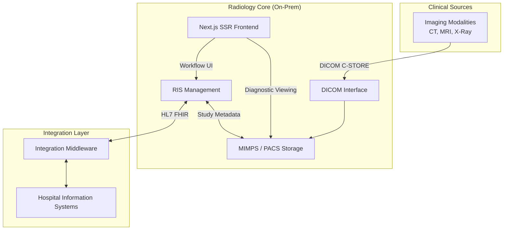

## Strategic Impact

The platform transformed radiology operations from a cost-center into a streamlined, internally-owned asset.

*   **Financial Excellence**: Achieved a **60% reduction in licensing and operational costs** by migrating from legacy foreign vendors to an in-house stack.
*   **Operational Velocity**: Reduced the time-to-integration for new hospital deployments by standardizing the interoperability layer.
*   **Regulatory Leadership**: Fully compliant with Indonesian healthcare regulations (**TKDN, CPAKB, and AKD certification**), facilitating smooth local adoption.
*   **Engineering Ownership**: Eliminated "Black Box" vendor dependencies, allowing for rapid feature deployment and custom clinical workflows.
*   **Award-Winning Innovation**: Recognized as the top internal innovation at the **Kalbe Innovation Convention 2024**.

---

## System Architecture

The architecture was designed as a **cloud-native, edge-ready** platform. While development and CI/CD occur in **Azure**, the production environment is optimized for **on-premise Kubernetes clusters** to meet strict data residency requirements.

It utilizes our core interoperability engine as its backbone:
[**Universal Healthcare Integration Middleware**](/case-studies/universal-healthcare-integration-middleware)

### Core Engineering Pillars

1.  **PACS (MIMPS) Engine**: A robust DICOM-compliant storage and retrieval system that handles massive imaging studies with high availability.
2.  **RIS (Workflow Management)**: Orchestrates patient scheduling, exam tracking, and radiologist reporting.
3.  **Modern Frontend (Next.js SSR)**: A high-performance web interface designed for radiologists. Using SSR ensures that **Sensitive Patient Data (PHI)** is processed on the server, minimizing the browser footprint and enhancing security.
4.  **Hybrid Infrastructure**: Orchestrated with **GitHub Actions**, moving from **Azure** development environments to **On-Premise Kubernetes** production environments.

---

## The Challenge: Breaking the "Black Box"

The primary challenge was the **High Barrier to Entry** in healthcare tech. Legacy vendors often provide "Black Box" systems that are:
*   Slow to integrate with local EMRs.
*   Prohibitively expensive to scale.
*   Difficult to customize for local regulatory needs (SATUSEHAT integration, local reporting formats).

---

## Technical Solutions & Decisions

### 1. Hybrid Interoperability
**Decision**: Instead of building point-to-point links, I implemented a **Middleware-First approach**.
**Result**: The RIS/PACS can now "talk" to almost any Hospital Information System (HIS) using a standardized FHIR/HL7 bridge, making deployments modular and predictable.

### 2. Security via Server-Side Rendering
**Decision**: Chose **Next.js SSR** specifically for clinical compliance.
**Result**: By performing data fetching on the server, we eliminated direct API exposure from the client-side. This architecture ensures that even in complex hospital networks, the attack surface for PHI (Protected Health Information) is kept to a minimum.

### 3. Kubernetes at the Edge
**Decision**: Automated resource management using **Kubernetes** for on-premise hospital servers.
**Result**: This allows us to provide "Cloud-like" reliability—including self-healing and easy updates—even when the system is running on a physical server inside a hospital's basement.

---

## Final Results

The project marked a turning point in the company's digital strategy. We successfully delivered:
*   **70% Cost Efficiency**: Saved significantly on foreign currency outflows.
*   **Zero-Vendor Dependency**: We own every line of code, from the DICOM handler to the UI.
*   **Scalability**: The system is active in production, serving thousands of studies with high uptime.

> **Winner: Kalbe Innovation Convention 2024**  
> "A technical masterpiece that proves internal engineering can outperform global vendors while delivering massive business value."

---

## Technology Stack

*   **Frontend**: Next.js, Tailwind CSS, Svelte (Internal Tools)
*   **Backend**: Go, Node.js, Integration Middleware
*   **Interoperability**: HL7 v2, FHIR, DICOM
*   **Infrastructure**: Kubernetes, Azure, Docker
*   **DevOps**: GitHub Actions, ArgoCD
*   **Regulatory**: TKDN, CPAKB, AKD Certified
