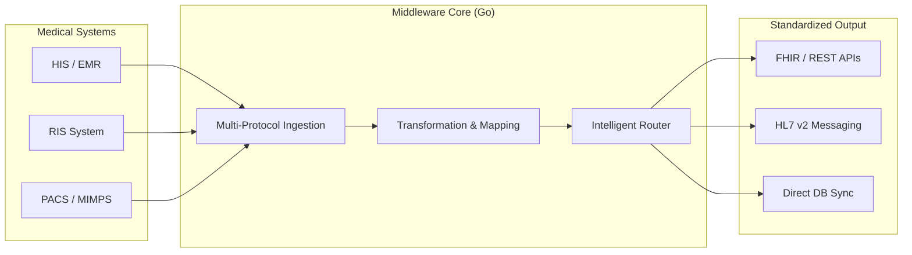

## Proven Impact at Scale

This project transformed how the organization handles large-scale hospital integrations by moving from "custom coding" to "configuration-driven" deployment.

*   **Massive Reach**: Successfully deployed and battle-tested in **35+ hospital environments** across Indonesia.
*   **High Throughput**: Orchestrates **10,000+ imaging studies monthly** in real-time, ensuring zero delay in clinical workflows.
*   **Zero-Invasive Integration**: Achieved 100% interoperability without requiring a single line of code change in the hospital's existing (and often vendor-locked) legacy systems.
*   **Operational Efficiency**: Reduced the engineering man-hours required for new hospital rollouts by **70%** through a reusable, adapter-based architecture.
*   **Infrastructure Optimization**: Go's lightweight runtime allowed the middleware to run on minimal hardware (even legacy Windows/Linux servers), saving infrastructure costs for client hospitals.

---

## System Architecture

The middleware is designed as a **Multi-Protocol Hub**. It doesn't just pass strings; it validates, transforms, and routes complex medical messages according to clinical logic.

### Strategic Technical Features

1.  **Dual-Mode Processing**:
    *   **Active Polling**: Aggressively retrieves data from legacy databases (MSSQL, MySQL) that lack push capabilities.
    *   **Passive Listening**: Real-time event handling for modern systems supporting Webhooks or HL7 MLLP.
2.  **Concurrency at Core**: Leveraging **Go Goroutines** to handle simultaneous hospital streams without blocking critical clinical data flow.
3.  **Adapter Pattern Architecture**: Quickly swap between FHIR, HL7, or proprietary JSON/XML formats without re-writing the core routing logic.

---

## The Problem: The Integration "Spaghetti"

Before this platform, every new hospital client required a custom-built "bridge." This led to:
*   **Maintenance Chaos**: 35 different versions of integration code to maintain.
*   **Latency**: Legacy integrations were often slow, causing delays in radiologists seeing patient data.
*   **Fragility**: If one system updated its DB schema, the whole bridge broke.

---

## My Engineering Approach

### 1. Unified Codebase, Config-Driven Behavior
I redesigned the entire bridge system into a single Go-based platform. Hospital-specific logic (DB schemas, API endpoints, transformation rules) was moved into **YAML-based configurations**.
**Result**: We now maintain **one** codebase instead of dozens. A new hospital can be specialized in hours, not weeks.

### 2. High-Performance Transformation
Medical data often needs to be "mapped" (e.g., converting a local "Hospital Code" to a standardized "FHIR Resource"). Using Go's efficient string and JSON handling, we achieved sub-millisecond transformation times.

### 3. Resilience and Monitoring
In healthcare, a missed message can delay a diagnosis. I implemented robust **retry mechanisms** and **centralized logging** to ensure that medical records are delivered even during temporary network outages.

---

## Results & Growth

The "Universal Middleware" is now the standard integration engine for all our radiology deployments.
*   **35+ Hospitals** connected.
*   **10,000+ Monthly Exams** processed.
*   **Single-digit ms latency** for message routing.
*   **Reliable for 24/7 clinical operations**.

---

## Technology Stack

*   **Language**: Go (Golang)
*   **Interoperability**: HL7 v2, FHIR (Fast Healthcare Interoperability Resources)
*   **Protocols**: REST API, Webhooks, TCP/MLLP, XML
*   **Databases**: SQL Server, PostgreSQL, MySQL
*   **Deployment**: Cross-platform binaries (Windows/Linux Service), Docker
loyments