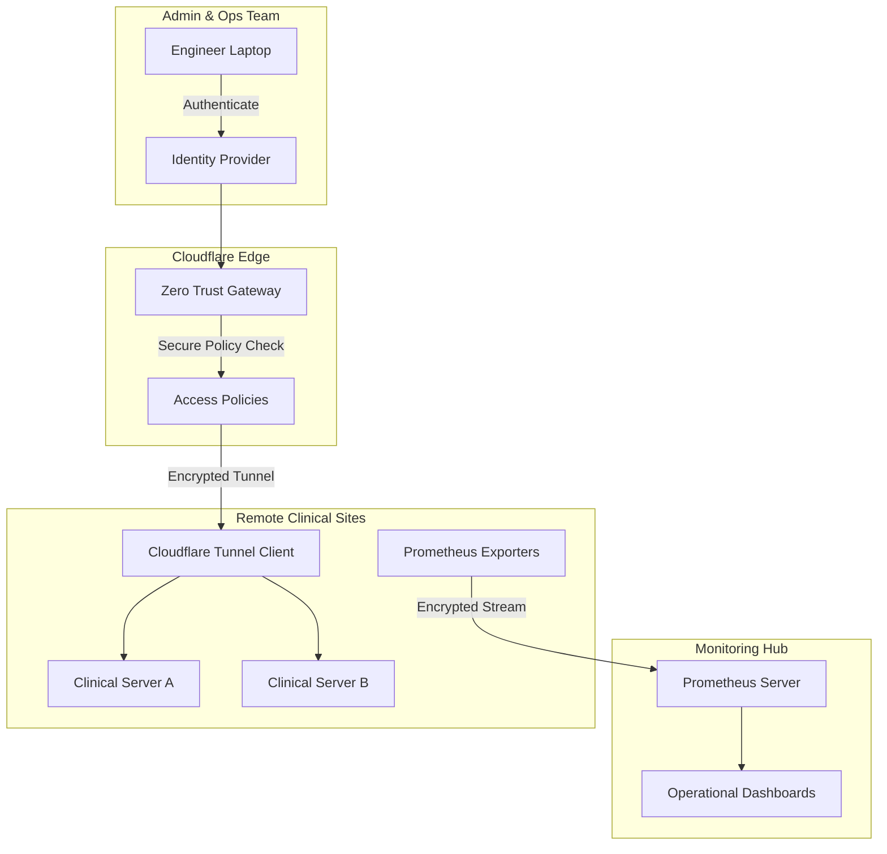

## Strategic Engineering Impact

*   **Cost Liberation**: Transitioned from high-seat-cost SaaS tools to an owned, elastic architecture, cutting monthly remote-access overhead by **90%**.
*   **Hardened Security**: Eliminated all inbound firewall rules. Devices now use outbound "Tunnels," making them invisible to the public internet and resilient against scanning/brute-force attacks.
*   **Identity-Based Access**: Replaced shared passwords with a brokered authentication layer. Access is now tied to company identity (SSO), providing a full audit trail of who accessed which device and when.
*   **Proactive Observability**: Moved from a "reactive" (user calls with problem) to a "proactive" (system alerts on high CPU/Disk) maintenance model.
*   **Scalability**: The architecture allows us to onboard new customer sites in minutes by simply deploying a pre-configured Docker container or binary.

---

## Architecture: The Zero-Trust Control Plane

The design follows the principle of **"Never Trust, Always Verify."**

### Technical Pillars

1.  **Cloudflare Tunnels (The "Invisibility Cloak")**: Instead of opening SSH ports (Port 22), each device runs a daemon that establishes an outbound-only connection. This bypasses complex hospital NAT/Firewall issues without compromising security.
2.  **Telemetry Pipeline**: Real-time system health (CPU, RAM, Storage, Services) is scraped via **Node Exporters** and aggregated into a centralized Prometheus instance.
3.  **Bespoke Dashboards**: Grafana was used to build high-level "Bird's Eye" views of the entire fleet, allowing the ops team to spot trends (e.g., storage filling up) before they caused clinical downtime.

---

## The Challenge: Legacy Security Debt

Previously, the team relied on commercial remote desktop software. This created several bottlenecks:
*   **Security "Holes"**: External software often requires specific permissions or ports that hospital IT departments are reluctant to grant.
*   **No Centralized Data**: We could "see" the screen, but we couldn't query the system's "health" historically.
*   **Scaling Costs**: As the number of managed devices grew, the license fees became a major financial burden.

---

## The Engineering Solution

### 1. Moving from VPN to Zero-Trust
Traditional VPNs grant a user access to the *entire network*. I implemented Zero-Trust policies that grant access to only *specific applications* (e.g., just the internal web admin or just the SSH terminal).
**Result**: Even if an engineer's credentials were compromised, the blast radius is limited.

### 2. Infrastructure as Code (IaC)
The monitoring and tunnel configuration was standardized as a set of setup scripts. 
**Result**: Onboarding a new device became a predictable, 5-minute task, ensuring consistency across the fleet.

### 3. Unified Observability
By centralizing Prometheus, we began to see the "hidden" causes of failures—such as a specific database service that leaked memory over 48 hours. 
**Result**: We started fixing bugs *before* they caused the devices to crash, significantly improving our SLA.

---

## Results

*   **90% Cost Savings**: Thousands of dollars in monthly subscriptions eliminated.
*   **Invisibility**: Our fleet is no longer reachable via public IP scans.
*   **100% Visibility**: Every device reports its heartbeats and metrics 24/7.
*   **SSO Integration**: Employee de-provisioning automatically revokes access to all remote devices instantly.

---

## Technology Stack

*   **Networking**: Cloudflare Zero Trust, Cloudflare Tunnels (cloudflared)
*   **Observability**: Prometheus, Grafana, Node Exporter
*   **System**: Linux (Ubuntu/Debian), Bash scripting
*   **Security**: WAF, Identity-based Access Policies, SSH-over-Warp
